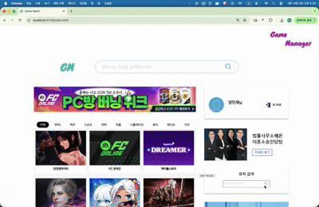

# Game_Match_Full

<p align="center">
  
</p>

게임 커뮤니티 기능과 친선 경기 매칭 기능을 결합한 풀스택 웹 서비스입니다.

<br/>

<div align="center">

<a href="https://github.com/Siwon-Choi/Game_Match_FE">
  
</a>
<a href="https://github.com/Siwon-Choi/Game_Match_BE">
  
</a>

</div>

---

## 프로젝트 개요

Game Match는 사용자가 게임별 커뮤니티 게시글을 작성하고, 친선 경기 매칭을 신청하며, 팀원을 등록해 함께 플레이할 수 있도록 설계한 웹 서비스입니다.

커뮤니티의 자유로운 소통과 매칭 데이터의 정합성을 함께 고려하며, 프론트엔드와 백엔드를 분리한 풀스택 구조로 개발했습니다.

---

## Repository

| 구분 | 저장소 | 설명 |
| --- | --- | --- |
| Frontend | [Game_Match_FE](https://github.com/Siwon-Choi/Game_Match_FE) | React 기반 사용자 화면, 게시글/매칭 UI |
| Backend | [Game_Match_BE](https://github.com/Siwon-Choi/Game_Match_BE) | Spring Boot 기반 API 서버, 인증/매칭/게시글 로직 |

---

## 주요 기능

| 기능 | 설명 |
| --- | --- |
| 사용자 인증 | 회원가입, 로그인, JWT 기반 인증 흐름 |
| 커뮤니티 게시글 | 게임별 게시글 작성, 조회, 수정, 삭제 |
| 친선 매칭 | 매칭 신청, 상태 관리, 만료 처리 |
| 팀원 관리 | 매칭에 참여할 팀원 등록 및 관리 |
| 검색 및 조회 | 게시글과 매칭 데이터를 조건에 따라 탐색 |

---

## 기술 스택

| 영역 | 기술 |
| --- | --- |
| Frontend | JavaScript, CSS,JQuery |
| Backend | Java, Spring Boot, Spring Security, JPA |
| Database | MySQL |
| Design | Figma |
| Infra | AWS EC2, Docker |

---

## 핵심 구현 경험

- 도메인별 책임을 분리한 백엔드 서비스 구조 설계
- JWT 기반 인증/인가 흐름 구현
- 매칭 신청, 팀원 등록, 만료 처리 과정의 데이터 정합성 고려
- 대량 테스트 데이터 기반 쿼리 성능 검증
- 프론트엔드와 백엔드 API 연동 흐름 구성

---

## 프로젝트 구조

```text
Game_Match_Full
├── Frontend
│   └── https://github.com/Siwon-Choi/Game_Match_FE
└── Backend
    └── https://github.com/Siwon-Choi/Game_Match_BE
